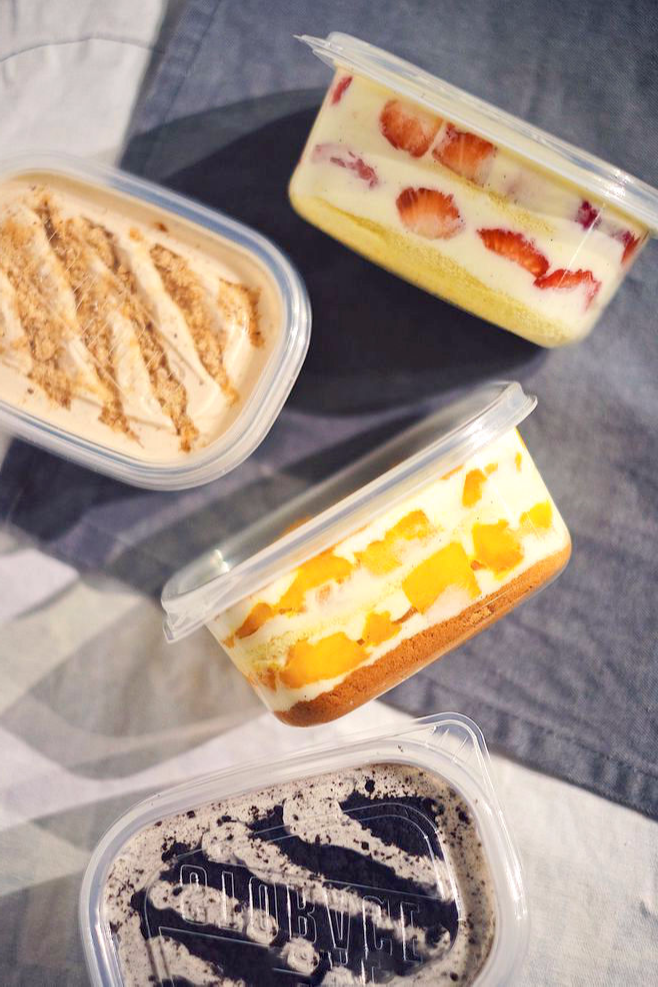

<!DOCTYPE html>
<html >
  <!-- Site made with Mobirise Website Builder v4.8.6, https://mobirise.com -->
  <meta charset="UTF-8">
  <meta http-equiv="X-UA-Compatible" content="IE=edge">
  <meta name="generator" content="Mobirise v4.8.6, mobirise.com">
  <meta name="viewport" content="width=device-width, initial-scale=1, minimum-scale=1">
  <link rel="shortcut icon" href="assets/images/double-chocolate-cake-122x122.png" type="image/x-icon">
  <meta name="description" content="">
  <title>HeziCake</title>
  <link rel="stylesheet" href="assets/tether/tether.min.css">
  <link rel="stylesheet" href="assets/bootstrap/css/bootstrap.min.css">
  <link rel="stylesheet" href="assets/bootstrap/css/bootstrap-grid.min.css">
  <link rel="stylesheet" href="assets/bootstrap/css/bootstrap-reboot.min.css">
  <link rel="stylesheet" href="assets/socicon/css/styles.css">
  <link rel="stylesheet" href="assets/dropdown/css/style.css">
  <link rel="stylesheet" href="assets/animatecss/animate.min.css">
  <link rel="stylesheet" href="assets/theme/css/style.css">
  <link href="assets/fonts/style.css" rel="stylesheet">
  <link rel="stylesheet" href="assets/mobirise/css/mbr-additional.css" type="text/css">
  
  
  
</head>
<body>
  <section class="menu cid-r77ZDKnro7" once="menu" id="menu1-d">

    

    <nav class="navbar navbar-expand beta-menu navbar-dropdown align-items-center navbar-fixed-top navbar-toggleable-sm">
        <button class="navbar-toggler navbar-toggler-right" type="button" data-toggle="collapse" data-target="#navbarSupportedContent" aria-controls="navbarSupportedContent" aria-expanded="false" aria-label="Toggle navigation">
            

                
                
                
                
            

        </button>
        

            

                
                    
                
                <a class="navbar-caption text-white display-5" href="hezicake.home.html">
                        盒 子 蛋 糕</a>
            

        

        

            <ul class="navbar-nav nav-dropdown" data-app-modern-menu="true"><li class="nav-item">
                    
                </li></ul>
            
<a class="btn btn-sm btn-white-outline display-5" href="hezicake.ordernow.html#form1-o">马上预订</a>

        

    </nav>
</section>

<section class="engine"><a href="https://mobirise.info/m">free website design templates</a></section><section class="header4 cid-r77Itosfqr" id="header4-4">

    

    

    

        

            

                <h1 class="mbr-section-title align-center mbr-white pb-3 mbr-bold mbr-fonts-style display-1"> { 盒 子 蛋 糕 }</h1>
                
                

                    
• 美味你的生活 •

                

                
<a class="btn btn-md btn-black-outline display-5" href="hezicake.signin.html">会员注册</a>
                    <a class="btn btn-md btn-black-outline display-5" href="hezicake.ordernow.html">预订蛋糕</a>

            

            

                
            

        

    

</section>

<section class="cid-r780wOHGcd" id="footer1-e">

    

    

    

        

            

                

                    
                

            

            

                <h5 class="pb-3">地 址</h5>
                

                    1234 Street Name
                     City, AA 99999
                

            

            

                <h5 class="pb-3">&nbsp;联 络</h5>
                
hezicake@gmail.com 09-5678910  

            

            

                <h5 class="pb-3">负 责 人</h5>
                
<em>李茄绮 吴诗慧 叶芊金 翁于芊</em>

            

        

        

            

                

                    

                

            

            

                

                    

                        © Copyright 2018 hezicake - All Rights Reserved
                    

                

                

                    

                        

                            <a href="https://twitter.com/mobirise" target="_blank">
                                
                            </a>
                        

                        

                            <a href="https://www.facebook.com/pages/Mobirise/1616226671953247" target="_blank">
                                
                            </a>
                        

                        

                            <a href="https://www.youtube.com/c/mobirise" target="_blank">
                                
                            </a>
                        

                        

                            <a href="https://instagram.com/mobirise" target="_blank">
                                
                            </a>
                        

                        

                            <a href="https://plus.google.com/u/0/+Mobirise" target="_blank">
                                
                            </a>
                        

                        

                            <a href="https://www.behance.net/Mobirise" target="_blank">
                                
                            </a>
                        

                    

                

            

        

    

</section>

  
  
  
  
  
  
  
  
  
  
  
 
<a style="text-align: center;"><i></i></a>

    <input name="animation" type="hidden">
